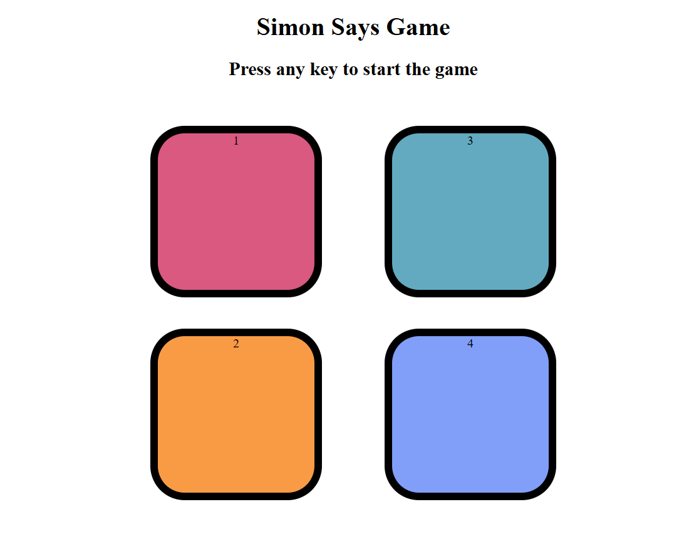
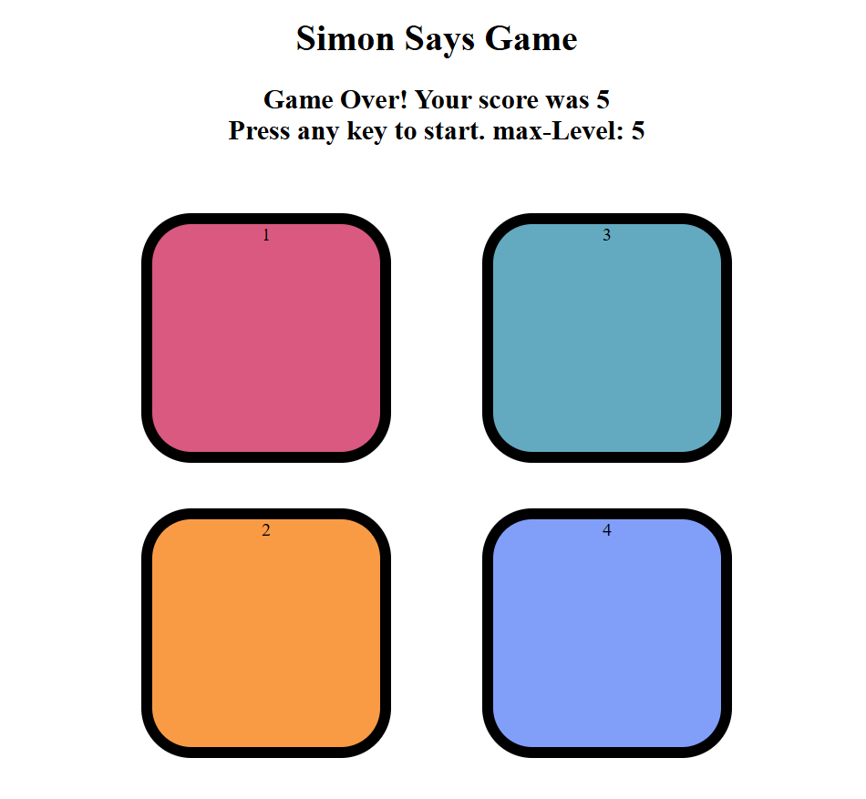

# 🎮 Simon Game

A simple memory-based color sequence game built using **HTML**, **CSS**, and **JavaScript**. The player must repeat the randomly generated sequence of colors. Each correct round adds another color to the sequence, increasing the difficulty.

---

## 📸 Preview





---

## 🛠️ Tech Stack

- **HTML** – Structure of the game.
- **CSS** – Styling and layout.
- **JavaScript** – Game logic and interactivity.

---

## 🎯 How to Play

1. Press any key to start the game.
2. Watch the sequence of flashing colors.
3. Repeat the exact sequence by clicking the buttons.
4. If you click the wrong color, the game is over.
5. Try to reach the highest level you can!

---

## ✨ Features

- ✅ Smooth UI with responsive design.
- ✅ Color animations.
- ✅ Keeps track of current level.
- ✅ Game Over auto reset screen levels.

---

## 🔧 Additional Features You Can Add

| Feature                          | Description |
|----------------------------------|-------------|
| 🏆 High Score Tracker            | Store highest level using `localStorage`. |

---

## 🧪 How to Run Locally

1. Clone the repository:
   ```bash
   git clone https://github.com/your-username/simon-game.git